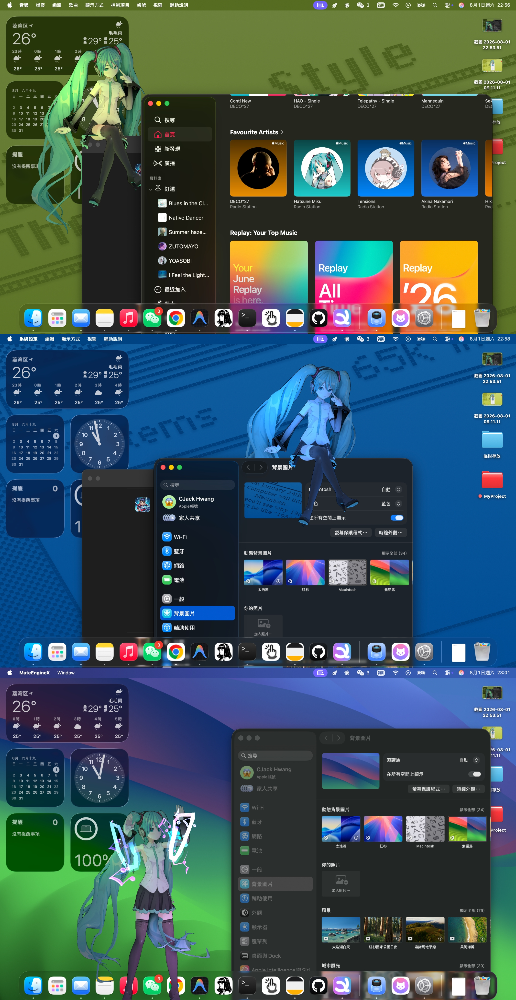

# 🍎 Mate Engine for macOS · 伙伴引擎 macOS 版 · Mate Engine macOS 版

**Unofficial native macOS port — a desktop pet app with custom VRM avatars, ported from Mate Engine.**

|  |  |
|---|---|
| **This repo** | [`freckslaydown-byte/Mate-Engine-Mac-X`](https://github.com/freckslaydown-byte/Mate-Engine-Mac-X) |
| **Fork source** (macOS) | [`CJackHwang/Mate-Engine-Mac-X`](https://github.com/CJackHwang/Mate-Engine-Mac-X) |
| **Official upstream** (Windows) | [`shinyflvre/Mate-Engine`](https://github.com/shinyflvre/Mate-Engine) |
| **Secondary upstream** (unfinished macOS) | [`BNDSer/Mate-Engine-Mac`](https://github.com/BNDSer/Mate-Engine-Mac) |
| **Platform** | Apple Silicon (M1 and newer) · macOS 26+ (not Intel, not macOS ≤ 15) |
| **Engine** | Unity 6000.4.8f1 + native Objective-C plugins |
| **License** | MateEngine Pro License v2.1 (see [LICENSE.md](LICENSE.md)) |
| **Docs** | [ROADMAP.md](ROADMAP.md) (milestones & vision) · [VERSIONING.md](VERSIONING.md) (branching & backout) · [gpt-sovits-setup.md](docs/gpt-sovits-setup.md) (TTS: self-host vs cloud, app config) · [low-resource-config.md](docs/low-resource-config.md) (MacBook Neo & low-memory Macs) |

> ⚠️ **Unofficial notice** — This is a community-made, **unofficial** port. The official project targets Windows. This project is forked from [`CJackHwang/Mate-Engine-Mac-X`](https://github.com/CJackHwang/Mate-Engine-Mac-X), which itself continues the unfinished [`BNDSer/Mate-Engine-Mac`](https://github.com/BNDSer/Mate-Engine-Mac) branch. Note that `Marksonthegamer/Mate-Engine-Linux-Port` is a separate, also-unofficial Linux port and is unrelated to this macOS port.
>
> 🚧 **Work in progress** — This port is still under **active development and will contain bugs**. Features may be incomplete, and not all official (Windows) features are available yet. If you hit a problem, please report it via [Issues](https://github.com/freckslaydown-byte/Mate-Engine-Mac-X/issues).

---

# 🌐 Language / 言語選択 / 语言选择

- [English](#english)
- [日本語](#japanese)
- [中文](#chinese)

---

## English

### What is this?

**Mate Engine** is a free, lightweight desktop-pet app — an open-source alternative to *Desktop Mate* — with custom VRM avatars and modding support. This project is a **native port to macOS**, built with **Unity 6000.4.8f1** and native Objective-C plugins, supporting **Apple Silicon (M1 and newer) on macOS 26+**.

Based on the upstream `Prepare 3.4 Features` branch (after X3.3).

> 🚧 **Status: work in progress** — this port is still actively developed and **will have bugs**. Some features are incomplete, and not all official Windows features are available yet. If something breaks, [open an issue](https://github.com/freckslaydown-byte/Mate-Engine-Mac-X/issues).

> 💬 **Questions? Ask in [Discussions](https://github.com/freckslaydown-byte/Mate-Engine-Mac-X/discussions).** Questions, help, and ideas go there — the issue tracker is reserved for confirmed bugs and roadmap items.

#### 📸 Real-Device Test Screenshots




#### 📚 Project Lineage

| Role | Repo | Notes |
|---|---|---|
| Official upstream | [shinyflvre/Mate-Engine](https://github.com/shinyflvre/Mate-Engine) | Official Windows version by the original author |
| Secondary upstream | [BNDSer/Mate-Engine-Mac](https://github.com/BNDSer/Mate-Engine-Mac) | Unfinished macOS port: v1 fixed WinAPI for basic macOS use → v2 replaced the LLM backend & added TTS → … → v8 dance-action selection; window-sitting basics; Unity 6000.4.8f1 |
| Fork source | [CJackHwang/Mate-Engine-Mac-X](https://github.com/CJackHwang/Mate-Engine-Mac-X) | Continues BNDSer's unfinished work and **completes the macOS port**: build scripts, native plugins, ScreenCaptureKit music dancing, ambient light, full i18n and polish |
| This fork | [freckslaydown-byte/Mate-Engine-Mac-X](https://github.com/freckslaydown-byte/Mate-Engine-Mac-X) | Forked from CJackHwang's completed port — the active fork: SuperClaw daemon (handshake + TTS speak), macOS dev loop (`update_macos.sh`), roadmap & versioning governance |

#### ✨ Porting Feature Support

**Native macOS plugins (clang-built `.bundle`, Apple Silicon arm64)**

| Plugin | Purpose |
|---|---|
| `MacSystem.bundle` | Window management, screen-capture authorization (`CGRequestScreenCaptureAccess`), display queries |
| `MacWindowList.bundle` | Front-to-back window enumeration (powers window-sitting) |
| `MacAudioMonitor.bundle` | ScreenCaptureKit system-audio capture (dance to music) |
| `MacWindowFix.bundle` | macOS-specific window interaction fixes (e.g. focus-flicker) |

**Core features**

| Feature | Status | Notes | Roadmap pillar |
|---|---|---|---|
| Native macOS | ✅ | Apple Silicon (arm64, M1+), macOS 26+; tracks new macOS releases | macOS currency |
| Transparent borderless always-on-top window | ✅ | Via UniWindowController | macOS currency |
| Window sitting | ✅ | Sits on the top/bottom edge of windows (`up` / `down` / `auto` modes); absolute occlusion below the sit-line; runtime depth/height fine-tuning | macOS currency |
| Dance to music | ✅ | ScreenCaptureKit system-audio capture (requires Screen Recording permission); 20 dance clips selectable | Use cases |
| Ambient light | ✅ | Follows the desktop color scheme in real time (requires Screen Recording permission); on by default, adaptive brightness; falls back to regular manual lighting without permission | Use cases |
| 13-language i18n | ✅ | EN / zh-Hans / zh-Hant / ja / ko / de / es / fr / pl / ru / tr / uk / kk — JA/ZH priority | Use cases |
| AI chat | ✅ | LLM backend replaced with the Anthropic API | Advancing technology |
| TTS voice | ✅ | GPT-SoVITS; independent volume control, repeat & interrupt playback | Advancing technology |
| SuperClaw daemon (handshake + TTS speak) | 🚧 | Reports program/hostname/model on startup and model change; remote speak via GPT-SoVITS. On `feature/daemon-handshake` / `feature/daemon-commands`, merges after M2 cleanup | Advancing technology |
| Crash recovery | ✅ | Dedicated crash-recovery scene + temporary empty scene | macOS currency |
| CJK & Korean font fallback | ✅ | Dynamic font fallback, no more "tofu" boxes | Use cases |
| VRM file picker | ✅ | Fixed macOS file-picker line-wrapping that misread VRM as DLC | macOS currency |
| Launch-window auto-fit | ✅ | Scales to the main display's visible workspace (minus menu bar / Dock) | macOS currency |
| Smart settings menu | ✅ | Runtime-generated rows, corrected text/control layout | Use cases |
| Out-of-box defaults | ✅ | Polished picture, soft ambient light, core features enabled by default | Use cases |

🔒 **Privacy by design** — the daemon handshake sends only **program name, hostname, and model info**; screen / mouse / keyboard data never leaves the device.

#### 🆚 Differences from the Official (Windows) Version

| Aspect | Official (Windows) | This macOS port |
|---|---|---|
| Platform | Windows 10/11 | Apple Silicon (arm64, M1+), macOS 26+ |
| Dance to music | Windows audio-loopback capture | ScreenCaptureKit system-audio capture, **requires Screen Recording permission** |
| Sitting target | Window + taskbar | Window top/bottom edges (macOS has no taskbar; `up` / `down` / `auto` modes) |
| Ambient light | None | **New**: follows desktop color scheme (requires Screen Recording permission) |
| LLM backend | Local QWEN 2.5 1.5b | Anthropic API (cloud) |
| TTS voice | None | **New**: GPT-SoVITS TTS |
| System permissions | None | Screen Recording (ambient light + dancing) |
| Code signing | Unsigned (antivirus false positives) | ad-hoc signed by default; Developer ID + notarization recommended for release |
| Steam Workshop | ✅ | ⚠️ Windows-only; not supported / unverified on the macOS port |

#### 🚀 Download & Usage

**Download from Releases**

Download the latest release — `MateEngineX-v1.1.0-macOS.zip` (or `MateEngineX.dmg`, built with `PACKAGE_DMG=1`) — from the [Releases](https://github.com/freckslaydown-byte/Mate-Engine-Mac-X/releases) page, unzip, and drag `MateEngineX.app` into `/Applications/`. Requires macOS 26+ on Apple Silicon (M1 or newer).

**First run**

1. **Bypass Gatekeeper** (unsigned/not-notarized app): right-click `MateEngineX.app` → **Open**; or allow it under System Settings → Privacy & Security.
2. Grant **Screen Recording** permission (for ambient light and dancing): System Settings → Privacy & Security → Screen Recording → enable `MateEngineX`.
3. Launch the app. **Right-click the pet** or press **`M`** to open the settings menu.
4. Import your own VRM model from the menu (`.vrm` / `.me` / `.prefab` supported).

#### 🔐 Permissions

**Screen Recording** (System Settings → Privacy & Security → Screen Recording) is used for:

- Ambient light (follows the desktop color scheme)
- Dance to music (system-audio capture)

Without permission the app **degrades gracefully**: it won't auto-dance, and ambient light falls back to regular manual lighting. Everything else works normally.

⚠️ **ad-hoc signing note**: default builds are ad-hoc signed (`codesign -s -`), so macOS treats every rebuild as a *new* app and Screen Recording permission is lost after each update. Reset & re-authorize:

```bash
tccutil reset ScreenCapture com.Shinymoon.MateEngineX
# Relaunch the app → click "Allow" in the prompt → quit fully and relaunch
```

To keep permission across updates, sign with a real certificate (optionally notarize):

```bash
SIGN_IDENTITY="Developer ID Application: Your Name (TEAMID)" NOTARIZE=1 ./Tools/build_macos.sh
```

#### 🛠 Build & Run (macOS)

**Prerequisites**: macOS 26+, [Unity 6000.4.8f1](https://unity.com/releases/editor/whats-new/6000.4.8f1), Xcode Command Line Tools (`clang`).

```bash
./Tools/build_macos.sh        # Builds Builds/macOS/MateEngineX.app (native plugins → Unity build → sign → arch check)
./Tools/launch_test.sh        # Launches the app and prints audio-capture diagnostics
./Tools/install_macos.sh      # Installs to /Applications/MateEngineX.app
```

The output is `Builds/macOS/MateEngineX.app` — copy it into `/Applications/` to install.

**Build parameters (environment variables)**

| Variable | Description |
|---|---|
| `UNITY_BIN` | Path to the Unity executable (auto-detects 6000.4.8f1) |
| `SIGN_IDENTITY` | Signing identity (default: ad-hoc `-`) |
| `NOTARIZE=1` | Notarize with Apple (requires `APPLE_ID` / `APPLE_TEAM_ID` / `APPLE_ID_PASSWORD`) |
| `PACKAGE_DMG=1` | Also produce a `.dmg` disk image |

#### ⚖️ License

This project inherits the upstream license: **MateEngine Pro License v2.1** — see [LICENSE.md](LICENSE.md) for the full terms. Please read them carefully before distributing.

- Third-party components are governed by their own licenses; see [NOTICE.txt](NOTICE.txt) for the full index of bundled components, their licenses, and their `LICENSE`/`NOTICE` file locations.
- The default avatar is All Rights Reserved by [Yorshka Shop](https://yorshkasencho.booth.pm/). Do not redistribute this model in your builds.
- Scripts and native-plugin code added by this port are released under the same license.

#### ❤️ Support the Official Project

This is a community port — features and future updates depend on the original author, so please support them:

- **Buy on Steam**: [MateEngine](https://store.steampowered.com/app/3625270/MateEngine/) — any Steam purchase helps development and future updates; it remains free on GitHub forever.
- **Free Hatsune Miku VRM**: [booth.pm](https://booth.pm/en/items/3226395)

#### 🙏 Credits

- [shinyflvre/Mate-Engine](https://github.com/shinyflvre/Mate-Engine) — official upstream, original author
- [BNDSer/Mate-Engine-Mac](https://github.com/BNDSer/Mate-Engine-Mac) — secondary upstream; foundational macOS porting work (v1–v8, window-sitting basics, LLM/TTS swap)
- [CJackHwang/Mate-Engine-Mac-X](https://github.com/CJackHwang/Mate-Engine-Mac-X) — fork source; **completed the macOS port** (build scripts, native plugins, ScreenCaptureKit music dancing, ambient light, full i18n)
- [maoxig/MateEngine-CustomDancePlayer](https://github.com/maoxig/MateEngine-CustomDancePlayer) — community mod: custom dance player
- Full upstream README (EN/JA/ZH) and the Desktop-Mate feature comparison are in the [official repo](https://github.com/shinyflvre/Mate-Engine)

---------------------------------------------------------------------

## Japanese

# 🍎 Mate Engine macOS 版

> 📄 **ドキュメント（英語のみ・翻訳推奨）** — [gpt-sovits-setup.md](docs/gpt-sovits-setup.md)（GPT-SoVITS のセットアップ：自前サーバー vs クラウド、アプリ設定）・ [low-resource-config.md](docs/low-resource-config.md)（MacBook Neo 等の低スペック Mac 向け設定）。ブラウザの翻訳機能をご利用ください。**コード部分は翻訳せず、そのままコピーしてください。**

**非公式ネイティブ macOS 移植版 — カスタム VRM アバター対応のデスクトップペットアプリ。** Apple Silicon（M1 以降）· macOS 26+ 対応。

|  |  |
|---|---|
| **本リポジトリ** | [`freckslaydown-byte/Mate-Engine-Mac-X`](https://github.com/freckslaydown-byte/Mate-Engine-Mac-X) |
| **フォーク元リポジトリ**（macOS） | [`CJackHwang/Mate-Engine-Mac-X`](https://github.com/CJackHwang/Mate-Engine-Mac-X) |
| **公式元リポジトリ**（Windows） | [`shinyflvre/Mate-Engine`](https://github.com/shinyflvre/Mate-Engine) |
| **二次元リポジトリ**（未完成のmacOS） | [`BNDSer/Mate-Engine-Mac`](https://github.com/BNDSer/Mate-Engine-Mac) |
| **対応環境** | Apple Silicon（M1 以降）· macOS 26+（Intel 非対応、macOS 15 以前も非対応） |
| **エンジン** | Unity 6000.4.8f1 + ネイティブ Objective-C プラグイン |
| **ライセンス** | GNU AGPL v3 & MateProv2 |

> ⚠️ **非公式のお知らせ** — これはコミュニティ製の**非公式**移植です。公式版はWindows向けです。本プロジェクトは [`CJackHwang/Mate-Engine-Mac-X`](https://github.com/CJackHwang/Mate-Engine-Mac-X) からのフォークであり、同リポジトリは未完成の [`BNDSer/Mate-Engine-Mac`](https://github.com/BNDSer/Mate-Engine-Mac) の作業を引き継いでいます。なお、`Marksonthegamer/Mate-Engine-Linux-Port` は別系統の非公式Linux移植であり、このmacOS移植とは無関係です。
>
> 🚧 **開発中** — 本移植は現在も活発に開発中であり、**バグが含まれています**。一部の機能は未完成で、公式Windows版の全機能はまだ利用できません。問題が発生した場合は [Issues](https://github.com/freckslaydown-byte/Mate-Engine-Mac-X/issues) から報告してください。
>
> 💬 **質問は [Discussions](https://github.com/freckslaydown-byte/Mate-Engine-Mac-X/discussions) へ。** 質問・ヘルプ・アイデアはこちらで。Issues は確定したバグとロードマップ項目専用です。

### 📸 実機テストのスクリーンショット


### 📚 プロジェクトの系譜

| 役割 | リポジトリ | 説明 |
|---|---|---|
| 公式元リポジトリ | [shinyflvre/Mate-Engine](https://github.com/shinyflvre/Mate-Engine) | 原作者による公式Windows版 |
| 二次元リポジトリ | [BNDSer/Mate-Engine-Mac](https://github.com/BNDSer/Mate-Engine-Mac) | 未完成のmacOS移植：v1でWinAPIを修正してmacOSで基本動作 → v2でLLMバックエンド差し替え＆TTS追加 → … → v8でダンスアクション選択；ウィンドウ座りの基礎；Unity 6000.4.8f1 へ更新 |
| フォーク元リポジトリ | [CJackHwang/Mate-Engine-Mac-X](https://github.com/CJackHwang/Mate-Engine-Mac-X) | BNDSerの未完成作業を引き継ぎ、**macOS移植を完成**：ビルドスクリプト、ネイティブプラグイン、ScreenCaptureKitによる音楽ダンス、アンビエントライト、完全なi18nと仕上げ |
| 本リポジトリ | [freckslaydown-byte/Mate-Engine-Mac-X](https://github.com/freckslaydown-byte/Mate-Engine-Mac-X) | CJackHwangの完成版移植からのフォーク — 現行フォークとして継続：SuperClawデーモン（ハンドシェイク＋TTS発話）、macOS開発ループ（`update_macos.sh`）、ロードマップ＆バージョニング管理 |

### ✨ 移植機能の対応状況

**ネイティブ macOS プラグイン（clang でビルドした `.bundle`、ユニバーサルバイナリ）**

| プラグイン | 用途 |
|---|---|
| `MacSystem.bundle` | ウィンドウ管理、画面収録の認可（`CGRequestScreenCaptureAccess`）、ディスプレイ情報の取得 |
| `MacWindowList.bundle` | 前面から背面へのウィンドウ列挙（「ウィンドウ座り」の基盤） |
| `MacAudioMonitor.bundle` | ScreenCaptureKit によるシステム音声キャプチャ（音楽に合わせてダンス） |
| `MacWindowFix.bundle` | macOS 専用のウィンドウ操作修正（フォーカス時のちらつきなど） |

**コア機能**

| 機能 | 状態 | 説明 | ロードマップの柱 |
|---|---|---|---|
| ネイティブ macOS | ✅ | Apple Silicon（arm64、M1以降）、macOS 26+；新macOSリリースにも追随 | macOS現行性 |
| 透明・枠なし・常に最前面のウィンドウ | ✅ | UniWindowController を使用 | macOS現行性 |
| ウィンドウ座り | ✅ | ウィンドウの上/下エッジに座る（`up` / `down` / `auto` の3モード）；座線以下の完全遮蔽；実行時・深さ/高さの微調整 | macOS現行性 |
| 音楽に合わせてダンス | ✅ | ScreenCaptureKit によるシステム音声キャプチャ（画面収録権限が必要）；ダンスは20クリップから選択可能 | ユースケース |
| アンビエントライト | ✅ | デスクトップの配色にリアルタイム追従（画面収録権限が必要）；デフォルトON・明るさ自動調整；権限がない場合は通常の手動ライトにフォールバック | ユースケース |
| 13言語のローカライズ | ✅ | EN / 簡中 / 繁中 / 日本語 / 韓国語 / 独語 / 西語 / 仏語 / 波語 / 露語 / トルコ語 / ウクライナ語 / カザフ語 — 日本語・中国語優先 | ユースケース |
| AIチャット | ✅ | LLMバックエンドを Anthropic API に差し替え | 技術の進化 |
| TTS音声 | ✅ | GPT-SoVITS；個別音量、繰り返し/割り込み再生に対応 | 技術の進化 |
| SuperClaw デーモン（ハンドシェイク＋TTS発話） | 🚧 | 起動時とモデル変更時にプログラム名/ホスト名/モデル情報を報告；GPT-SoVITS によるリモート発話。`feature/daemon-handshake` / `feature/daemon-commands` で開発中、M2 クリーンアップ後に main へマージ | 技術の進化 |
| クラッシュリカバリ | ✅ | 専用のクラッシュリカバリシーン＋一時的な空シーン | macOS現行性 |
| 日中韓フォントのフォールバック | ✅ | 動的フォントフォールバックで「豆腐」表示を防止 | ユースケース |
| VRMファイル選択 | ✅ | macOSのファイル選択ダイアログの改行によりVRMがDLCと誤判定される問題を修正 | macOS現行性 |
| 起動ウィンドウの自動サイズ調整 | ✅ | メインディスプレイの可視ワークスペースに合わせて縮小（メニューバー/Dockを除く） | macOS現行性 |
| スマート設定メニュー | ✅ | 実行時に動的生成する行、修正されたテキスト/コントロール配置 | ユースケース |
| 初期設定の最適化 | ✅ | 美しい画面、柔らかいアンビエントライト、コア機能はデフォルトON | ユースケース |

🔒 **プライバシー設計** — デーモンのハンドシェイクは**プログラム名・ホスト名・モデル情報のみ**を送信；画面・マウス・キーボードのデータが端末の外に出ることはありません。

### 🆚 公式（Windows）版との違い

| 項目 | 公式（Windows） | 本macOS移植 |
|---|---|---|
| 対応環境 | Windows 10/11 | Apple Silicon（arm64、M1以降）、macOS 26+ |
| 音楽ダンス | Windowsオーディオループバック | ScreenCaptureKitによるシステム音声キャプチャ、**画面収録権限が必要** |
| 座る対象 | ウィンドウ＋タスクバー | ウィンドウの上/下エッジ（macOSにタスクバーは無し、`up`/`down`/`auto`モード） |
| アンビエントライト | なし | **新規**：デスクトップ配色に追従（画面収録権限が必要） |
| LLMバックエンド | ローカルQWEN 2.5 1.5b | Anthropic API（クラウド） |
| TTS音声 | なし | **新規**：GPT-SoVITS TTS |
| システム権限 | なし | 画面収録（アンビエントライト＋ダンス） |
| コード署名 | 未署名（誤検知あり） | デフォルトはad-hoc署名；リリース時はDeveloper ID＋公証を推奨 |
| Steam Workshop | ✅ | ⚠️ Windows限定；macOS移植では未対応・未検証 |

### 🚀 ダウンロードと使い方

**Releases からダウンロード**

[Releases](https://github.com/freckslaydown-byte/Mate-Engine-Mac-X/releases) ページから最新リリース（`MateEngineX-v1.1.0-macOS.zip`。`PACKAGE_DMG=1` でビルドした `MateEngineX.dmg` もあります）をダウンロードし、解凍して `MateEngineX.app` を `/Applications/` へドラッグ＆ドロップしてください。動作環境：macOS 26+（Apple Silicon、M1以降）。

**初回起動**

1. **Gatekeeper の回避**（未署名・未公証アプリ）：`MateEngineX.app` を右クリック → **開く**；または「システム設定 → プライバシーとセキュリティ」で許可。
2. **画面収録**権限を許可（アンビエントライトとダンス用）：システム設定 → プライバシーとセキュリティ → 画面収録 → `MateEngineX` を有効化。
3. アプリを起動。**ペットを右クリック**、または **`M`** キーで設定メニューを開く。
4. メニューから自分のVRMモデルを読み込む（`.vrm` / `.me` / `.prefab` 対応）。

### 🔐 権限について

**画面収録（Screen Recording）**（システム設定 → プライバシーとセキュリティ → 画面収録）は以下に使用します：

- アンビエントライト（デスクトップ配色に追従）
- 音楽に合わせてダンス（システム音声キャプチャ）

権限がない場合は**機能が制限されます**：自動ダンスを行わず、アンビエントライトは通常の手動ライトにフォールバックします。それ以外の機能は正常に動作します。

⚠️ **ad-hoc署名の注意**：デフォルトのビルドはad-hoc署名（`codesign -s -`）のため、macOSは再ビルドのたびに「新しいアプリ」とみなし、画面収録権限が毎回リセットされます。リセットと再許可：

```bash
tccutil reset ScreenCapture com.Shinymoon.MateEngineX
# アプリを再起動 → プロンプトで「許可」→ 完全終了して再起動
```

更新をまたいで権限を維持したい場合は、正式な証明書で署名（任意で公証）してください：

```bash
SIGN_IDENTITY="Developer ID Application: あなたの名前 (TEAMID)" NOTARIZE=1 ./Tools/build_macos.sh
```

### 🛠 ビルドと実行（macOS）

**前提条件**：macOS 26+、[Unity 6000.4.8f1](https://unity.com/releases/editor/whats-new/6000.4.8f1)、Xcode Command Line Tools（`clang`）。

```bash
./Tools/build_macos.sh        # Builds/macOS/MateEngineX.app をビルド（ネイティブプラグイン → Unityビルド → 署名 → アーキテクチャ確認）
./Tools/launch_test.sh        # アプリを起動し、音声キャプチャの診断ログを表示
./Tools/install_macos.sh      # /Applications/MateEngineX.app にインストール
```

出力は `Builds/macOS/MateEngineX.app`。`/Applications/` にコピーすればインストール完了です。

**ビルドパラメータ（環境変数）**

| 変数 | 説明 |
|---|---|
| `UNITY_BIN` | Unity実行ファイルのパス（6000.4.8f1を自動検出） |
| `SIGN_IDENTITY` | 署名ID（デフォルト：ad-hoc `-`） |
| `NOTARIZE=1` | Apple公証を実行（`APPLE_ID` / `APPLE_TEAM_ID` / `APPLE_ID_PASSWORD` が必要） |
| `PACKAGE_DMG=1` | `.dmg` ディスクイメージも生成 |

### ⚖️ ライセンス

本プロジェクトは元リポジトリのライセンスを引き継ぎます：**GNU AGPL v3 & MateProv2** — ライセンス条項をよくお読みください。

- デフォルトアバターは [Yorshka Shop](https://yorshkasencho.booth.pm/) が全権利を保有します。このモデルを自作ビルドで再配布しないでください。
- 本移植で追加されたスクリプトとネイティブプラグインのコードは同じライセンスで公開されます。

### ❤️ 公式プロジェクトを支援

これはコミュニティ移植です。機能や今後のアップデートは原作者に依存しているため、ぜひ支援してください：

- **Steamで購入**：[MateEngine](https://store.steampowered.com/app/3625270/MateEngine/) — 購入は開発と今後のアップデートに役立ちます。GitHubでは今後も完全無料です。
- **初音ミク無料VRM**：[booth.pm](https://booth.pm/en/items/3226395)

### 🙏 クレジット

- [shinyflvre/Mate-Engine](https://github.com/shinyflvre/Mate-Engine) — 公式元リポジトリ、原作者
- [BNDSer/Mate-Engine-Mac](https://github.com/BNDSer/Mate-Engine-Mac) — 二次元リポジトリ；macOS移植の基盤作業（v1〜v8、ウィンドウ座りの基礎、LLM/TTSの差し替え）
- [CJackHwang/Mate-Engine-Mac-X](https://github.com/CJackHwang/Mate-Engine-Mac-X) — フォーク元；**macOS移植を完成**（ビルドスクリプト、ネイティブプラグイン、ScreenCaptureKitによる音楽ダンス、アンビエントライト、完全なi18n）
- [maoxig/MateEngine-CustomDancePlayer](https://github.com/maoxig/MateEngine-CustomDancePlayer) — コミュニティMod：カスタムダンスプレイヤー
- 元リポジトリの完全なREADME（EN/JA/ZH）とDesktop Mateとの機能比較は [公式リポジトリ](https://github.com/shinyflvre/Mate-Engine) にあります

---------------------------------------------------------------------

## Chinese

# 🍎 伙伴引擎 macOS 版

> 📄 **文档（仅英文・建议用浏览器翻译）** — [gpt-sovits-setup.md](docs/gpt-sovits-setup.md)（GPT-SoVITS 设置：自建服务器 vs 云端、应用配置）・ [low-resource-config.md](docs/low-resource-config.md)（MacBook Neo 等低配 Mac 的配置）。请使用浏览器的翻译功能阅读。**代码块请勿翻译，直接复制即可。**

**非官方 macOS 原生移植版 — 支持自定义 VRM 角色的桌面宠物应用。** 支持 Apple Silicon（M1 及更新）· macOS 26+。

|  |  |
|---|---|
| **本项目** | [`freckslaydown-byte/Mate-Engine-Mac-X`](https://github.com/freckslaydown-byte/Mate-Engine-Mac-X) |
| **Fork 来源**（macOS） | [`CJackHwang/Mate-Engine-Mac-X`](https://github.com/CJackHwang/Mate-Engine-Mac-X) |
| **官方上游**（Windows） | [`shinyflvre/Mate-Engine`](https://github.com/shinyflvre/Mate-Engine) |
| **二级上游**（未完成的 macOS 版） | [`BNDSer/Mate-Engine-Mac`](https://github.com/BNDSer/Mate-Engine-Mac) |
| **平台** | Apple Silicon（M1 及更新）· macOS 26+（不支持 Intel，也不支持 macOS 15 及更早） |
| **引擎** | Unity 6000.4.8f1 + 原生 Objective-C 插件 |
| **许可** | GNU AGPL v3 & MateProv2 |

> ⚠️ **非官方声明** — 本项目为社区**非官方**移植，官方版本面向 Windows。本项目 fork 自 [`CJackHwang/Mate-Engine-Mac-X`](https://github.com/CJackHwang/Mate-Engine-Mac-X)，后者接续未完成的 [`BNDSer/Mate-Engine-Mac`](https://github.com/BNDSer/Mate-Engine-Mac) 继续开发。另请注意：`Marksonthegamer/Mate-Engine-Linux-Port` 是独立的非官方 Linux 移植，与本 macOS 移植无关。
>
> 🚧 **仍在开发中** — 本移植项目工作仍在进行，**仍会存在很多 Bug**。部分功能可能不完整，官方 Windows 版的全部功能尚未全部支持。如遇问题，请在 [Issues](https://github.com/freckslaydown-byte/Mate-Engine-Mac-X/issues) 中反馈。
>
> 💬 **有疑问？请到 [Discussions](https://github.com/freckslaydown-byte/Mate-Engine-Mac-X/discussions) 提问。** 问题、帮助和想法请在 Discussions 讨论；Issues 仅用于已确认的 Bug 和路线图事项。

### 📸 实机测试截图


### 📚 项目谱系

| 角色 | 仓库 | 说明 |
|---|---|---|
| 官方上游 | [shinyflvre/Mate-Engine](https://github.com/shinyflvre/Mate-Engine) | 原作者编写的 Windows 官方版 |
| 二级上游 | [BNDSer/Mate-Engine-Mac](https://github.com/BNDSer/Mate-Engine-Mac) | 未完成的 macOS 移植：v1 修复 WinAPI 使 Mac 基础可用 → v2 替换 LLM 后端、添加 TTS → … → v8 舞蹈动作选择；窗口坐基础；升级 Unity 6000.4.8f1 |
| Fork 来源 | [CJackHwang/Mate-Engine-Mac-X](https://github.com/CJackHwang/Mate-Engine-Mac-X) | 接续 BNDSer 的未完成工作，**完成 macOS 原生移植**：构建脚本、原生插件、ScreenCaptureKit 音乐舞蹈、氛围光、完整 i18n 与打磨 |
| 本项目 | [freckslaydown-byte/Mate-Engine-Mac-X](https://github.com/freckslaydown-byte/Mate-Engine-Mac-X) | fork 自 CJackHwang 的完成版移植 — 作为现行 fork 继续开发：SuperClaw 守护进程（握手 + TTS 语音）、macOS 开发循环（`update_macos.sh`）、路线图与版本管理 |

### ✨ 移植功能支持情况

**原生 macOS 插件（clang 编译的 .bundle，通用二进制）**

| 插件 | 用途 |
|---|---|
| `MacSystem.bundle` | 窗口管理、屏幕捕获授权（`CGRequestScreenCaptureAccess`）、显示器查询 |
| `MacWindowList.bundle` | 前→后窗口枚举（支撑“坐在窗口边缘”） |
| `MacAudioMonitor.bundle` | ScreenCaptureKit 系统音频捕获（随音乐跳舞） |
| `MacWindowFix.bundle` | macOS 专属窗口交互修正（失焦跳动等） |

**核心功能**

| 功能 | 状态 | 说明 | 路线图支柱 |
|---|---|---|---|
| 原生 macOS 运行 | ✅ | Apple Silicon（arm64、M1 及更新）、macOS 26+；持续适配 macOS 新版本 | macOS 时效 |
| 透明无边框置顶窗口 | ✅ | 通过 UniWindowController 实现 | macOS 时效 |
| 窗口坐立 / 吸附 | ✅ | 坐在窗口上/下边缘（`up` / `down` / `auto` 三种模式）；坐线以下绝对遮挡；运行时深度/高度微调 | macOS 时效 |
| 随音乐跳舞 | ✅ | ScreenCaptureKit 系统音频捕获（需屏幕录制权限）；20 个舞蹈片段可选 | 使用场景 |
| 氛围光 / 环境光 | ✅ | 实时跟随桌面配色（需屏幕录制权限）；默认开启、亮度自适应；无权限时回退常规手动灯光 | 使用场景 |
| 13 语言本地化 | ✅ | EN / 简中 / 繁中 / 日 / 韩 / 德 / 西 / 法 / 波兰 / 俄 / 土耳其 / 乌克兰 / 哈萨克 — 优先维护日文与中文 | 使用场景 |
| AI 对话 | ✅ | LLM 后端替换为 Anthropic API | 技术进步 |
| 语音合成 TTS | ✅ | GPT-SoVITS；独立音量控制、可重复/打断播放 | 技术进步 |
| SuperClaw 守护进程（握手 + TTS 语音） | 🚧 | 启动及模型变更时报告程序名/主机名/模型信息；通过 GPT-SoVITS 远程发声。在 `feature/daemon-handshake` / `feature/daemon-commands` 分支开发，M2 清理后合入 main | 技术进步 |
| 崩溃恢复 | ✅ | 专门的崩溃恢复场景 + 临时空场景 | macOS 时效 |
| 中/韩文等字体回退 | ✅ | 动态字体回退，避免“豆腐块” | 使用场景 |
| VRM 文件选择 | ✅ | 修复 macOS 文件选择器换行导致 VRM 被误判为 DLC 的问题 | macOS 时效 |
| 开屏窗口自适应 | ✅ | 按主显示器可见工作区缩放（扣除菜单栏/程序坞） | macOS 时效 |
| 智能设置菜单 | ✅ | 运行时动态生成的行、修正后的控件布局 | 使用场景 |
| 开箱即用默认参数 | ✅ | 画面精致、氛围灯柔和、核心功能默认开启 | 使用场景 |

🔒 **隐私设计** — 守护进程握手仅发送**程序名、主机名、模型信息**；屏幕、鼠标、键盘数据绝不离开设备。

### 🆚 与官方（Windows）版的差异

| 方面 | 官方（Windows） | 本移植（macOS） |
|---|---|---|
| 运行平台 | Windows 10/11 | Apple Silicon（arm64、M1 及更新）、macOS 26+ |
| 随音乐跳舞 | Windows 音频回环捕获 | ScreenCaptureKit 系统音频捕获，**需屏幕录制权限** |
| 坐立目标 | 窗口 + 任务栏 | 窗口上/下边缘（macOS 无任务栏，`up` / `down` / `auto` 模式） |
| 氛围光 | 无 | **新增**：实时跟随桌面配色（需屏幕录制权限） |
| LLM 后端 | 本地 QWEN 2.5 1.5b | Anthropic API（云端） |
| TTS 语音 | 无 | **新增**：GPT-SoVITS TTS |
| 系统权限 | 无特殊权限 | 屏幕录制权限（氛围光 + 随音乐跳舞） |
| 数字签名 | 未签名（有杀软误报） | 默认 ad-hoc 签名；发布建议 Developer ID + 公证 |
| Steam Workshop | ✅ | ⚠️ Windows 专属，macOS 移植暂不支持/未验证 |

### 🚀 下载与使用

**从 Release 下载**

从 [Releases](https://github.com/freckslaydown-byte/Mate-Engine-Mac-X/releases) 页面下载最新版本（`MateEngineX-v1.1.0-macOS.zip`，另有 `PACKAGE_DMG=1` 构建的 `MateEngineX.dmg`），解压后将 `MateEngineX.app` 拖入 `/Applications/`。需 macOS 26+（Apple Silicon，M1 或更新）。

**首次启动**

1. **绕过 Gatekeeper**（未签名/未公证应用）：右键点击 `MateEngineX.app` → **打开**；或在「系统设置 → 隐私与安全」中允许。
2. 授予**屏幕录制**权限（用于氛围光与随音乐跳舞）：系统设置 → 隐私与安全 → 屏幕录制 → 开启 `MateEngineX`。
3. 启动应用。**右键点击角色**或按 **`M`** 键打开设置菜单。
4. 在设置菜单中导入你的 VRM 模型（支持 `.vrm` / `.me` / `.prefab`）。

### 🔐 权限说明

**屏幕录制（Screen Recording）**（系统设置 → 隐私与安全 → 屏幕录制）用于：

- 氛围光（跟随桌面配色）
- 随音乐跳舞（系统音频捕获）

未授予权限时应用会**降级运行**：不自动跳舞、氛围光回退为常规手动灯光，其余功能不受影响。

⚠️ **ad-hoc 签名提示**：默认构建为 ad-hoc 签名（`codesign -s -`），macOS 会把每次重新构建当作新应用，屏幕录制权限在每次更新后都需要重新授权。重置并重新授权：

```bash
tccutil reset ScreenCapture com.Shinymoon.MateEngineX
# 重新启动应用 → 在系统提示中点「允许」→ 完全退出后再次启动
```

如需**跨更新保持权限**，请使用正式证书签名（并可选公证）：

```bash
SIGN_IDENTITY="Developer ID Application: 你的名字 (TEAMID)" NOTARIZE=1 ./Tools/build_macos.sh
```

### 🛠 构建与运行（macOS）

**前置要求**：macOS 26+、[Unity 6000.4.8f1](https://unity.com/releases/editor/whats-new/6000.4.8f1)、Xcode 命令行工具（`clang`）。

```bash
./Tools/build_macos.sh        # 构建 Builds/macOS/MateEngineX.app（原生插件 → Unity 打包 → 签名 → 架构校验）
./Tools/launch_test.sh        # 启动应用并打印音频捕获诊断
./Tools/install_macos.sh      # 安装到 /Applications/MateEngineX.app
```

产物输出在 `Builds/macOS/MateEngineX.app`，复制到 `/Applications/` 即可安装。

**构建参数（环境变量）**

| 变量 | 说明 |
|---|---|
| `UNITY_BIN` | Unity 可执行文件路径（默认自动探测 6000.4.8f1） |
| `SIGN_IDENTITY` | 签名身份（默认 ad-hoc `-`） |
| `NOTARIZE=1` | 进行 Apple 公证（需 `APPLE_ID` / `APPLE_TEAM_ID` / `APPLE_ID_PASSWORD`） |
| `PACKAGE_DMG=1` | 同时生成 .dmg 安装镜像 |

### ⚖️ 许可

本项目沿用上游许可：**GNU AGPL v3 & MateProv2**（请仔细阅读许可条款）。

- 默认角色模型版权归 [Yorshka Shop](https://yorshkasencho.booth.pm/) 所有，请勿在你的构建中再分发。
- 本移植新增的脚本与原生插件代码按相同许可发布。

### ❤️ 支持官方项目

本项目是社区移植，功能与后续更新依赖原作者持续开发，请支持他们：

- **Steam 购买**：[MateEngine](https://store.steampowered.com/app/3625270/MateEngine/) —— 任何 Steam 购买都将帮助开发与未来更新；GitHub 上始终免费。
- **免费初音未来 VRM**：[booth.pm](https://booth.pm/en/items/3226395)

### 🙏 致谢

- [shinyflvre/Mate-Engine](https://github.com/shinyflvre/Mate-Engine) — 官方上游，原作者
- [BNDSer/Mate-Engine-Mac](https://github.com/BNDSer/Mate-Engine-Mac) — 二级上游，macOS 移植的奠基工作（v1–v8、窗口坐基础、LLM/TTS 替换）
- [CJackHwang/Mate-Engine-Mac-X](https://github.com/CJackHwang/Mate-Engine-Mac-X) — Fork 来源，**完成 macOS 原生移植**（构建脚本、原生插件、ScreenCaptureKit 音乐舞蹈、氛围光、完整 i18n）
- [maoxig/MateEngine-CustomDancePlayer](https://github.com/maoxig/MateEngine-CustomDancePlayer) — 社区模组：自定义舞蹈播放器
- 上游完整的英文 / 日文 / 中文说明与功能对比请见 [官方仓库](https://github.com/shinyflvre/Mate-Engine)
